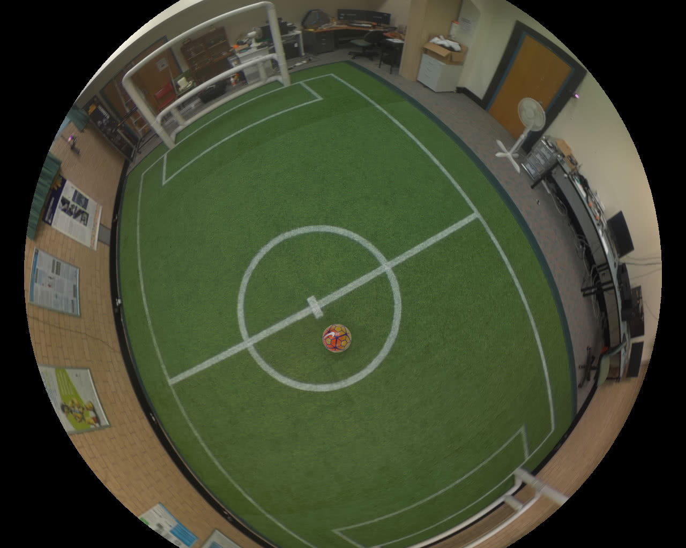
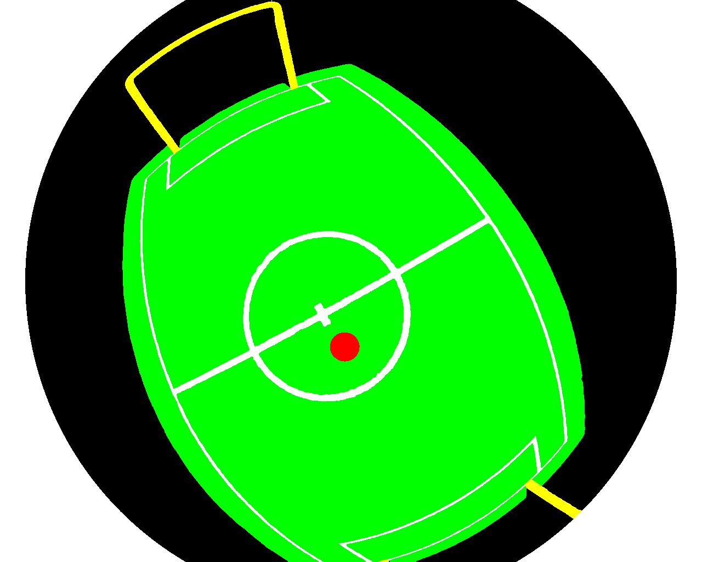

# Label
Label describes how the final labels for each of the visual mesh points will be provided.
These flavours also decide the loss function that will be used by the network when training.

## Classification
The classification label flavour is the typical method that is used when labelling each visual mesh point as a distinct class.
It works by providing a png image where each pixel has a unique rgb colour assigned to it.
Each class will be made up of one or more of these colours.

If a pixel has 0 opacity (is transparent) then that pixel is considered "unlabelled" and the contents of that pixel will not influence the training output.
This will also occur if a pixel has a colour that is not "claimed" by a specific class.
Take care with this as if you want multiple classes to be assigned to a background "environment" class

Below is an example of an image and the associated mask for that image.

Image|Mask
:-:|:-:
| 

### Loss Function
The loss function that is used by the visual mesh for classification is a class balanced focal loss [https://arxiv.org/abs/1708.02002](https://arxiv.org/abs/1708.02002).
In this loss function, the impact of each class is balanced so the number of examples in each class is weighted so all classes have equal impact on the loss function.
This loss function is able to be used when the final layer in the network is either `softmax` (for cases where there is a single correct class for each point) or `sigmoid` (where a class may have multiple layers simultaneously).

Focal loss is used here as it helps to emphasise the rarer cases in what would otherwise be homogenous data.
For example in the environment class in the example image, most of the environment is either carpet or wall.
Focal loss will de-emphasize these areas in order to get a better outcome.

### Dataset Keys
An image is required with a distinct colour being used for each class that is to be trained.
This image needs to be provided as a compressed png image.

```python
"mask": bytes[1] # a png image
```

### Configuration
The configuration for classification can have multiple colours for each class.
```yaml
label:
  type: Classification
  config:
    classes:
      - name: ball
        colours:
          - [255, 255, 255]
      - name: goal
        colours:
          - [255, 255, 0]
      - name: line
        colours:
          - [255, 255, 255]
      - name: field
        colours:
          - [0, 255, 0]
      - name: environment
        colours:
          - [0, 0, 0]
```

## Seeker
Seeker networks predict where in the visual mesh an object is.
The label takes a vector that is measured in camera space and for each point in the visual mesh predicts where in the mesh that object is as a relative offset.
It is typically used with a `tanh` activation layer as the final layer of the network.

### Loss Function
The loss function for the seeker network is made up of three components that are blended together in order to get an accurate result.
For close (`<0.5`)) points we do the mean squared error of our prediction and the target.
For points that are between 0.5 and 0.75 we calculate the distance of the absolute values, thereby ensuring that the magnitude is correct but ignoring the sign.
For the final far points we only check if the network has predicted them as having a distance of 0.75 or above.
If so we calculate the loss as being 0, otherwise we push it to be the correct value.

Once the object has gotten further than the receptive field of the network, it is impossible for it to predict where that object is.
In this case, the direction that the network predicts is less important than the network describing the point as "far away".
By having these three tiers for the loss function, we ensure that there is a smooth gradient for the network for these cases allowing it to predict "far away" without specifying a direction.

|Distance|Function|
|-|-|
|`0.0  < x < 0.5` |`(x - y)²`|
|`0.5  < x < 0.75`|`(|x| - |y|)²`|
|`0.75 < x < 1.0` |`|x| > 0.75 ? 0 : (|x| - |y|)²`|

### Dataset Keys
The seeker flavour requires targets to points that will be predicted.
The targets are measured in the cameras coordinate system.
```python
"seeker/targets": [n, 3] # n >= 1
```

### Configuration
```yaml
label:
  type: Seeker
  config:
    # The number of objects we predict distance for (-1->1 means -5 to 5 objects)
    scale: 5
```
